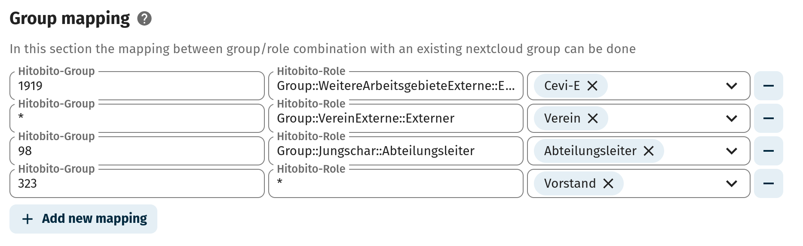

# Hitobito-Login

`Hitobito-Login` is an extension app for nextcloud enabling login functionality using an instance of [Hitobito](https://github.com/hitobito/hitobito) (open source organisation/community management tool) as authentication backend. It also implements group and role mapping between the two systems.

This application and its developers are not affiliated with, endorsed by, or associated with Puzzle ITC (the developers of Hitobito). All trademarks and copyrights belong to their respective owners.

## Installation
First the app needs to be installed on the Nextcloud instance:
1. Find the app in the app store
    - Go to `https://<your-nextcloud-instance-url>/settings/apps/security/hitobitologin`
        - Replace `<your-nextcloud-instance-url>` with your respective url
    - Alternatively login to your nextcloud instance and search `hitobitologin` in the app view.
2. Click on `Download and Enable`

Congratulations, the app is now installed on your Nextcloud instance.

## Configuration
The app can be configured over the configuration interface. The interface can be opened as follows:
- Go to `https://<your-nextcloud-instance-url>/settings/admin/hitobitologin`
        - Replace `<your-nextcloud-instance-url>` with your respective url
- Alternatively login to your nextcloud instance and go to `Administration Settings`. Afterwards search `Hitobito Login` in the overview on the left side.

### Hitobito OAuth-Token
Before being able to configure and use this app a OAuth token for it has to be generated on the Hitobito instance to be used. The token needs at least the `with_roles` scope in order to work correctly. A new OAuth token can be generated in Hitobito under `Settings->OAuth Applications`. If you cannot see this menu point you most probably do not have enough rights to generate such a token. Please then inform an administrator of your Hitobito instance of your need for such a token. You will need to provide a `redirect-url` to generate such a token. The `redirect-url` should be defined as follows: `https://<your-nextcloud-instance-url>/apps/hitobitologin/login/oauth`

### General Settings
The general settings section of the configuration consists of the following fields:
- Checkbox: `Automatically remove groups from user`
    - If this checkbox is set the user will lose all nextcloud groups that are not associated to him by a group mapping upon login.
- Checkbox: `Block users without a mapped group/role match`
    - If this checkbox is set users which do not have a group associated by a group mapping will not be able to login.
- Checkbox: `Search for existing users by email`
    - Setting this checkbox will allow the app to try to map existing users to Hitobito users by e-mail. **!!Beware that if multiple users with the same e-mail-address exist on the Nextcloud instance they will be prohibited from logging in with Hitobito!!**
- Checkbox: `Use Hitobito as default login`
    - Setting this checkbox will activate an automatic redirect to Hitobito skipping the Nextcloud login page. To login with a local user the following URL must be used: `https://<your-nextcloud-instance-url>/login?direct=1` 
- Input-Field: `Base-URL`
    - This field needs to be filled with the base url of the Hitobito instance to be used for authentication. `https://demo.hitobito.com` for example.
- Input-Field: `Client-ID`
    - This field has to be populated with the client-id of the Hitobito oauth-token. See [Hitobito OAuth-Token](#hitobito-oauth-token) for explanation how to create the token.
- Input-Field: `Client-Secret`
    - This field needs to be populated with the client-secret of the same Hitobito oauth-token as is used with the id.
- Input-Field: `Login-Button Text`
    - Here the text of the login button on the nextcloud login page can be adjusted.

### Group mapping
Group mappings enable automatic group assignment to users logging in via the Hitobito login functionality. This allows for close permission integration between the two applications. Mappings can be added by using the `Add new mapping` button on the bottom left of the page.

Each mapping contains the following three fields:
- Input-Field: `Hitobito-Group`
    - This field needs to be populated by the group-id of the group to be matched. The group-id can be found by navigating to the group on hitobito and looking at the URL `https://<base-url>/groups/<group-id>`. Instead of a group id `*` can be used so that any group matches with this mapping. This is usefull if only the role is relevant for the mapping. 
- Input-Field: `Hitobito-Role`
    - This field needs to be populated by the role-type/class of the role to be matched. The type names can be retrieved by using the `/api/roles/` endpoint. This field supports the use of one `*` which means that the following values are equally possible:
        - `*`
        - `Group::Dachverband::Administrator`
        - `Group::Dachverband::*`
        - `Group::*::Administrator`
        - `*::Dachverband::Administrator`
- Multi-Field: `Mapped-Groups`
    - This field contains the nextcloud groups that are going to get assigned to a user upon login if the mapping matches the user.

**Example:**

## Development Guide
### Documentation for developers:
- General documentation and tutorials: https://nextcloud.com/developer
- Technical documentation: https://docs.nextcloud.com/server/latest/developer_manual

### Help for developers:
- Official community chat: https://cloud.nextcloud.com/call/xs25tz5y
- Official community forum: https://help.nextcloud.com/c/dev/11
